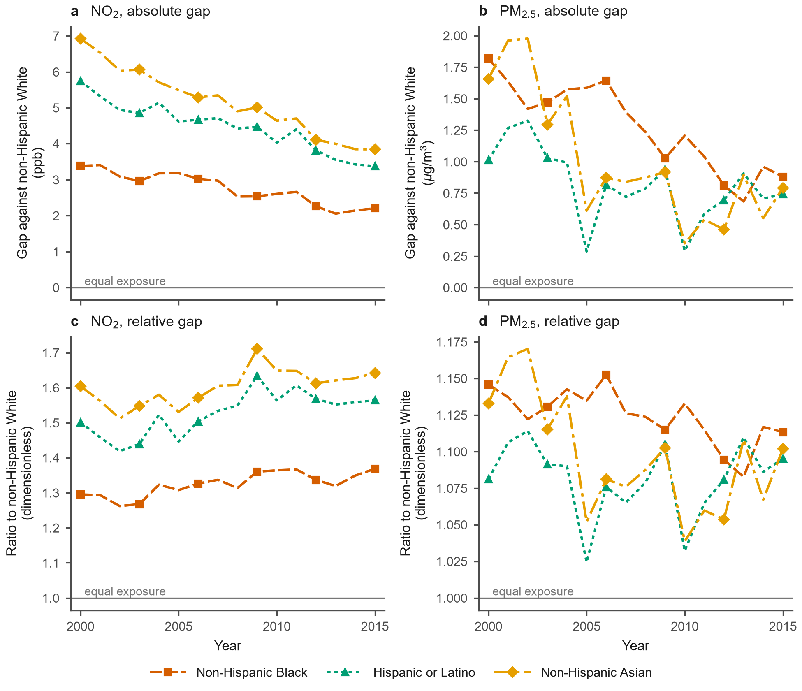

# Spatiotemporal-Exposure-Analysis

Air pollution exposure disparities by race, ethnicity and historical redlining grade across the census blocks of the contiguous United States, 2000-2015.

**Mohsen Nikfarjam and Ehsan Nikfarjam** ([mohsennikfarjam](https://github.com/mohsennikfarjam), [ehsannikfarjam](https://github.com/ehsannikfarjam)). These authors contributed equally.

**Status.** Two manuscripts in preparation, not yet peer reviewed; preprints are not yet posted. The results here are those of the current drafts and may change in review.

- Changes in absolute and relative racial and ethnic disparities in air pollution exposure across United States census blocks, 2000-2015
- Air pollution exposure disparities by race, ethnicity and historical redlining grade across 6.2 million United States census blocks

## Key points

**2000-2015**

- Absolute and relative measures of racial and ethnic disparity in nitrogen dioxide exposure moved in opposite directions, 2000 to 2015
- Fine particulate matter disparities narrowed on both measures for the Black and the Asian population over the same years
- Joining two census block vintages by identifier misallocates population and retains a non-random subset of blocks

**2010**

- Nitrogen dioxide exposure gaps between racial and ethnic groups arise mainly at the neighborhood and mid-range distance scales
- Small net fine particulate matter gaps can be the sum of large regional and local components of opposite sign
- Treating census blocks as independent understates the standard error of a disparity by a median factor of 43

*Every NO2 absolute gap narrowed while every NO2 ratio widened. For PM2.5, the Black and Asian series narrowed on both measures; the Hispanic ratio had no direction robust to the choice of years. The concentrations are modeled surfaces.*

## Abstracts

**2000-2015.** Aggregate improvement in air quality can conceal a change in environmental inequality and can be mistaken for progress on it. We assembled an annual block-level panel of modeled nitrogen dioxide (NO2) and fine particulate matter (PM2.5) concentrations for the contiguous United States and the District of Columbia, 6,234,988 census blocks by 16 years, and measured how exposure disparity by race and ethnicity changed between 2000 and 2015 with the population distribution held fixed at its 2010 values. The two standard measures of disparity diverged. For NO2 every group's absolute gap against the non-Hispanic White population narrowed while every ratio widened: the Black-White gap fell from 3.383 to 2.206 ppb while the ratio rose from 1.295 to 1.369. PM2.5 behaved differently, with both measures narrowing for the Black and the Asian population. A block fixed-effects panel reproduces the divergence on different units. Counting time at work, with 2010 commuting held fixed, leaves the NO2 divergence in place at every bound considered, and among primary-job holders at fixed 2010 locations the NO2 excess at the work block over the home block itself fell in ppb while rising as a percentage of the home mean. Eight-hour ozone nonattainment designation in 2004 was followed by NO2 reductions averaging about 1.3 to 1.8 ppb, whose size depends on how designated counties were selected. Disparity trends should be reported on both measures.

**2010.** Air pollution exposure in the United States differs by race and ethnicity. We measured modeled 2010 nitrogen dioxide (NO2) and fine particulate matter (PM2.5) at all 6,234,988 census blocks of the contiguous United States and the District of Columbia and decomposed each gap against the non-Hispanic White population by distance scale and by composition. Population-weighted mean NO2 exceeded the non-Hispanic White mean by 2.605 ppb for the Black, 4.033 for the Hispanic and 4.642 ppb for the Asian population; PM2.5 gaps were far smaller. Mid-range and neighborhood scales account for 83 to 85 percent of each NO2 gap; long range alone for 39.8 percent of the Black PM2.5 gap. NO2 also rises as the 1930s Home Owners' Loan Corporation grade falls; just under half of the 6.20 ppb Grade D minus Grade A contrast remains within cities. Among primary-job holders, workplace NO2 exceeded home NO2 by 1.199 to 1.918 ppb across coverage methods; counting up to a quarter of the year at work for the whole population raises no gap and lowers none by more than 0.162 ppb. Treating blocks as independent understates a gap's standard error by a median factor of 43. Disparities from block-level surfaces should therefore state the distance scale at which they arise and the block dependence assumed.

**A methods finding.** An identifier-only 2000-to-2010 block join captures 4.90 percent of the correct population-weighted allocation, and about 85 percent of the joined rows pair a 2000 block with a different 2010 block. The same join restricts the sample on identifier persistence, from 6,234,988 blocks to 3,080,166. Measured on the 2010 cross-section, the restriction alone raised the NO2 disparity gap against the non-Hispanic White population by 4.1 to 14.2 percent: from 2.605 to 2.711 ppb for the Black population (4.1 percent), from 4.033 to 4.491 ppb for the Hispanic population (11.4 percent) and from 4.642 to 5.302 ppb for the Asian population (14.2 percent).

## Designs

| Design | Question | Estimator | Limitation |
|---|---|---|---|
| 2010 cross-section | How large are the gaps, at which spatial scale do they arise, and how much reflects the included covariates? | Population-weighted gaps, scale decomposition, Oaxaca-Blinder with three reference choices | Descriptive; modeled concentrations |
| Home and workplace | Does counting time at work change the gaps and the trends? | Work block against home block for primary-job holders (LODES 7.5), and gaps with up to a quarter of the year at work; 2010 home and work locations held fixed for the trend | Bounds on the exposure measure, not daily exposure; primary jobs only |
| A. Nonattainment event study | Was ozone nonattainment designation followed by a relative decline in NO2? | Event study with block and year fixed effects, never-designated controls, county clustering; effect at minority share zero and average effect over treated blocks | Indirect treatment; size depends on the identifying assumption; a concurrent NOx trading program; the PM2.5 designations fail their pre-trend test; the distributional parameter is not identified |
| B. HOLC boundary discontinuity | Is there a step in modeled concentration at 1930s grade lines? | Local linear discontinuity with boundary-segment fixed effects, each year | A long-run association, not the effect of redlining as implemented |
| C. Block fixed-effects panel | Did concentrations fall faster where the minority share is higher? | Two-way fixed effects with Conley spatial standard errors | An association, not an identified effect |
| D. Compositional decomposition | How much of the 2000-2010 change was who lived where? | Index decomposition in two orderings with the NHGIS block crosswalk | Crosswalk allocation uncertainty is not propagated |

## Contents

| Path | What it holds |
|---|---|
| `Spatiotemporal_Analysis_Overview.ipynb` | Both analyses in one executed notebook: abstracts, Key Points, figures and tables with their manuscript captions, discussion, limitations, data availability and references. Figures are embedded, so it renders on GitHub without running. |
| `figures/` | Publication figures (PNG) |
| `results/` | Aggregated publication tables (CSV); no block-level rows and no source extracts |
| `docs/data_sources.md` | Inputs, providers, citations, licenses and access |

Rendered views: [nbviewer](https://nbviewer.org/github/Research-Portfolios/Spatiotemporal-Exposure-Analysis/blob/main/Spatiotemporal_Analysis_Overview.ipynb) and [Google Colab](https://colab.research.google.com/github/Research-Portfolios/Spatiotemporal-Exposure-Analysis/blob/main/Spatiotemporal_Analysis_Overview.ipynb).

## Scope

- The concentrations are modeled surfaces. The reported intervals exclude their prediction error and therefore understate total uncertainty.
- Ozone designation is an indirect treatment for NO2. A causal interpretation of the ozone-designation estimates is conditional on parallel trends and on the absence of concurrent policies that changed NO2 differentially in designated counties.
- The home and workplace comparison covers primary jobs. It uses annual mean concentrations and fixed 2010 commuting locations, and assumes that groups within a block share its worker fraction and destinations. These assumptions define bounds on the exposure measure rather than individual daily exposures, and workers cannot be treated as the whole population.
- Spatial scales (long range, mid range, neighborhood, near source) are distance scales of the concentration decomposition, not emission categories.
- Census blocks are not independent observations; intervals are clustered or spatially robust as each table states.

## Data

No input data are redistributed here. Each source is available from its provider under that provider's terms; see [docs/data_sources.md](docs/data_sources.md).

| Input | Provider | Citation |
|---|---|---|
| Annual NO2 and PM2.5 concentration model | CACES empirical geographic regression | Kim et al. (2020), PLOS ONE 15(2): e0228535 |
| Four-scale decomposition, census block level, 2000-2015 | Mendeley Data, doi:10.17632/bz8pdbcvf2.3 (Wang, 2022) | Wang et al. (2020), Atmospheric Environment 241: 117470 |
| Census block population by race and ethnicity, 2010 | IPUMS NHGIS | Manson et al. (2024) |
| HOLC security-grade polygons | Mapping Inequality, University of Richmond | Nelson et al. (2023) |
| Primary jobs by home block and work block (LODES version 7.5) | U.S. Census Bureau, LEHD | U.S. Census Bureau (2021) |
| Nonattainment designations | U.S. EPA Green Book | U.S. Environmental Protection Agency |
| Daily wildfire smoke PM2.5 | Harvard Dataverse, doi:10.7910/DVN/DJVMTV | Childs et al. (2022), Environmental Science and Technology 56(19) |

## Reproducing

The notebook reads only `figures/` and `results/` in this repository and runs without the input data (Python 3 with pandas and Pillow). The analysis pipeline that produced the results is not part of this release.

## Citation and license

Cite the repository with `CITATION.cff`; preprint citations will be added when they are posted. Code is released under the MIT license (`LICENSE`). Figures and tables are CC BY 4.0, except those derived from Mapping Inequality (CC BY-NC) or from the wildfire smoke predictions (CC BY-SA 4.0), listed in `LICENSE-FIGURES.md`.

## Related

- [Well-Siting-MCDA](https://github.com/Research-Portfolios/Well-Siting-MCDA): probabilistic multi-criteria well-siting analysis.
